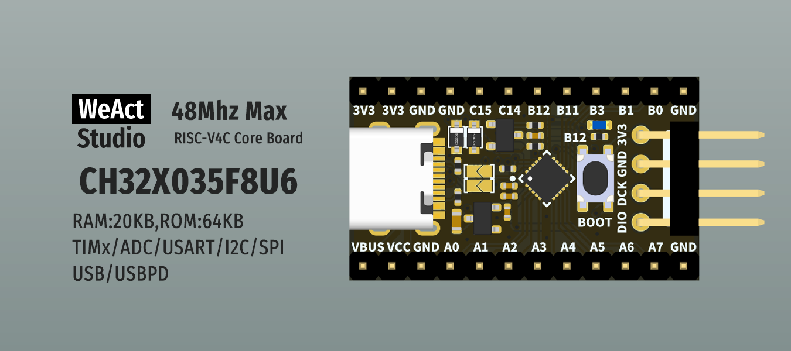

* [中文版本](./README_zh.md)
# WeActStudio.CH32X035CoreBoard

CH32X035F8U6
> 48Mhz Max,20KB RAM,64KB ROM

WCH Official Website www.wch-ic.com

|Dir Name|Explain|
| :--:|:--:|
|Doc|DataSheet/ReferenceManual|
|Hardware|Hardware Development Kit|
|Examples|Software Examples|
|SDK|Software Development Kit|
|Tools|Tools|

```
/*---------------------------------------
- WeAct Studio Official Link
- taobao: weactstudio.taobao.com
- aliexpress: weactstudio.aliexpress.com
- github: github.com/WeActStudio
- gitee: gitee.com/WeAct-TC
- blog: www.weact-tc.cn
---------------------------------------*/
```
